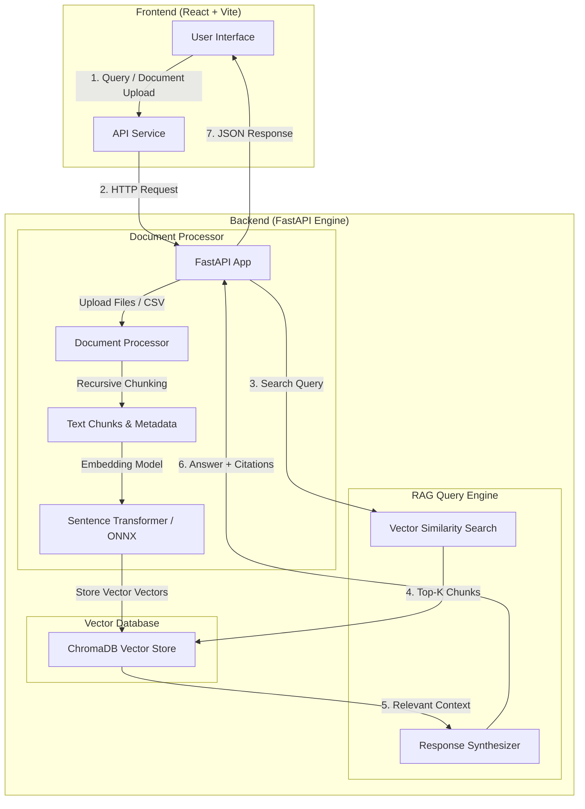

# Bank of Librio - Intelligent Banking RAG System 🏦🤖

An enterprise-grade Retrieval-Augmented Generation (RAG) system built for bank customer data analysis, document intelligence, and automated query answering. It combines **FastAPI**, **ChromaDB**, **Sentence Transformers**, and a modern **React + Vite** UI.

---

## 📐 System Architecture & Flow Diagram

### Architecture Overview




---

## ✨ Features

- **Multi-Format Document Support**: Ingest PDF, CSV, Excel (`.xlsx`), Word (`.docx`), and plain text (`.txt`) documents.
- **Fast Vector Search**: Powered by **ChromaDB** with sentence embeddings for semantically accurate information retrieval.
- **Auto Dataset Ingestion**: Automatic background loading of banking customer datasets upon server startup.
- **Interactive UI**: Sleek, responsive chat feed with document drawers, chunk inspectors, and real-time backend status monitors.
- **Render Ready**: Configured for seamless deployment on cloud platforms like Render.

---

## 🛠️ Technology Stack

- **Backend**: Python 3, FastAPI, Uvicorn, ChromaDB, Sentence Transformers, PyPDF, Pandas, OpenPyXL, Python-Docx
- **Frontend**: JavaScript (ES6+), React 19, Vite, Tailwind CSS v4
- **Deployment**: Render (FastAPI Web Service + Static Site Frontend)

---

## 🚀 API Reference

| Method | Endpoint | Description |
| :--- | :--- | :--- |
| `GET` | `/` | Root health check |
| `GET` | `/healthz` | Platform health monitoring |
| `GET` | `/api/health` | Detailed vector store health & document statistics |
| `GET` | `/api/documents` | List indexed documents and collection stats |
| `POST` | `/api/upload` | Upload and auto-chunk document files |
| `POST` | `/api/query` | RAG query processing (returns synthesized answer & citations) |
| `POST` | `/api/ingest-kaggle` | Auto-download and ingest Kaggle bank dataset |
| `DELETE` | `/api/documents/{filename}` | Remove a document from the vector store |

---

## 💻 Local Development Setup

### Prerequisites
- Python 3.10+
- Node.js 18+

### 1. Run Backend (FastAPI)
```bash
cd backend
pip install -r requirements.txt
uvicorn app:app --reload --port 8000
```
*Backend runs at `http://localhost:8000`*

### 2. Run Frontend (React + Vite)
```bash
cd frontend
npm install
npm run dev
```
*Frontend runs at `http://localhost:5173`*

---

## ☁️ Deployment Guide (Render)

### Backend Service (Web Service)
- **Environment**: Python 3
- **Root Directory**: `backend`
- **Build Command**: `pip install -r requirements.txt`
- **Start Command**: `uvicorn app:app --host 0.0.0.0 --port $PORT`

### Frontend Service (Static Site)
- **Root Directory**: `frontend`
- **Build Command**: `npm install && npm run build`
- **Publish Directory**: `dist`
- **Environment Variable**: `VITE_API_BASE_URL` = `https://your-backend-url.onrender.com`
