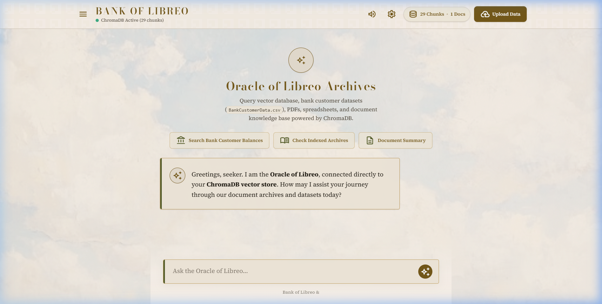
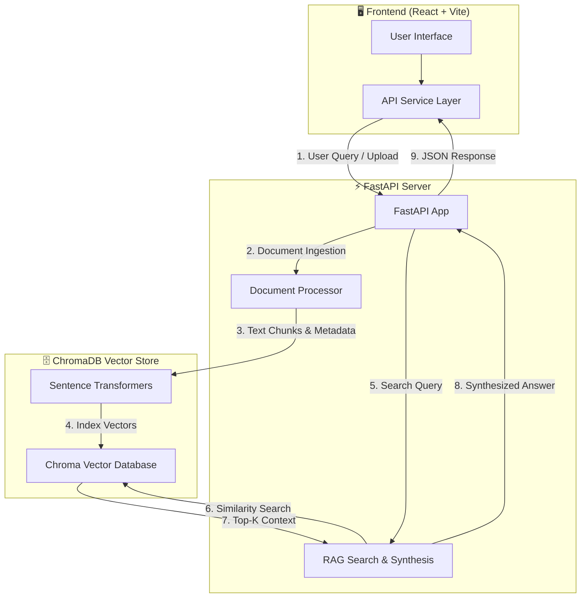

<div align="center">

# Bank of Libreo — Intelligent Banking RAG System

**An enterprise-grade Retrieval-Augmented Generation (RAG) system for bank data analysis, document intelligence, and AI-powered query answering.**

[](https://fastapi.tiangolo.com/)
[](https://react.dev/)
[](https://www.trychroma.com/)
[](https://www.python.org/)
[](https://vite.dev/)

</div>

---

## 🖥️ Live Preview

<p align="center">
  
</p>

*The Oracle of Libreo — RAG-powered chat interface connected to ChromaDB vector store*

---

## 📐 System Architecture & Flow



<details>
<summary>📊 <strong>View Full Architecture Diagram</strong></summary>
<br/>


</details>

---

## ✨ Features

| Feature | Description |
|---|---|
| 📄 **Multi-Format Ingestion** | PDF, CSV, Excel `.xlsx`, Word `.docx`, TXT, Markdown, JSON, HTML |
| 🔍 **Semantic Vector Search** | ChromaDB + Sentence Transformers for semantically accurate retrieval |
| 🤖 **AI Answer Synthesis** | Blended, paraphrased answers with cited sources |
| ⚡ **Auto Dataset Loading** | Background ingestion of banking datasets on server startup |
| 🧩 **Chunk Inspector** | Drill down into retrieved context chunks per answer |
| 🎨 **Premium UI** | Classical-themed chat interface with glassmorphism & dark palette |
| ☁️ **Render Ready** | One-click deployment to Render (backend + frontend) |

---

## 🛠️ Technology Stack

<div align="center">

| Layer | Technology |
|---|---|
| **Backend API** | Python 3, FastAPI, Uvicorn |
| **Vector Store** | ChromaDB, Sentence Transformers |
| **Document Parsing** | PyPDF2, Pandas, OpenPyXL, Python-Docx |
| **Frontend** | React 19, Vite 8, Tailwind CSS v4 |
| **Deployment** | Render (Web Service + Static Site) |

</div>

---

## 🚀 API Reference

| Method | Endpoint | Description |
| :--- | :--- | :--- |
| `GET` | `/` | Root health check |
| `GET` | `/healthz` | Platform health monitoring |
| `GET` | `/api/health` | Vector store health & document statistics |
| `GET` | `/api/documents` | List all indexed documents |
| `POST` | `/api/upload` | Upload & auto-chunk document files |
| `POST` | `/api/query` | RAG query → synthesized answer + citations |
| `POST` | `/api/ingest-kaggle` | Auto-download Kaggle bank dataset |
| `DELETE` | `/api/documents/{filename}` | Remove a document from vector store |

---

## 💻 Local Development

### Prerequisites
- Python 3.10+
- Node.js 18+

### ⚡ Quick Start (One Command)

```powershell
# From repo root — launches both servers in separate windows
.\start_dev.ps1
```

### Manual Setup

**Terminal 1 — Backend**
```bash
cd backend
pip install -r requirements.txt
uvicorn app:app --host 127.0.0.1 --port 8000 --reload
```
> Backend runs at `http://localhost:8000`

**Terminal 2 — Frontend**
```bash
cd frontend
npm install
npm run dev
```
> Frontend runs at `http://localhost:5173`

> **Note:** Vite takes ~25s on first start while bundling dependencies. Wait for the `VITE ready` message.

---

## ☁️ Deployment Guide (Render)

<details>
<summary>🔧 <strong>Backend Service (Web Service)</strong></summary>

| Setting | Value |
|---|---|
| Environment | Python 3 |
| Root Directory | `backend` |
| Build Command | `pip install -r requirements.txt` |
| Start Command | `uvicorn app:app --host 0.0.0.0 --port $PORT` |

</details>

<details>
<summary>🌐 <strong>Frontend Service (Static Site)</strong></summary>

| Setting | Value |
|---|---|
| Root Directory | `frontend` |
| Build Command | `npm install && npm run build` |
| Publish Directory | `dist` |
| Environment Variable | `VITE_API_BASE_URL` = `https://your-backend-url.onrender.com` |

</details>

---

<div align="center">

Built with ⚡ by **Bank of Librio** — *Banking with Strength. Built on Trust.*

</div>
